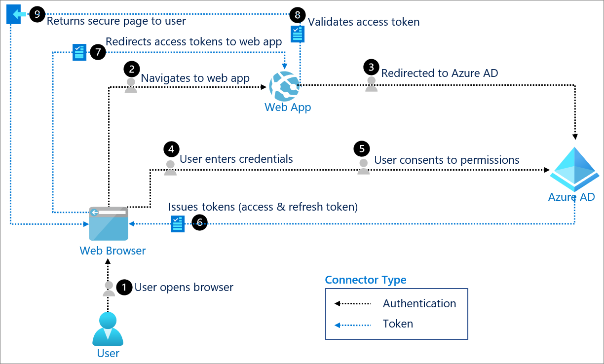

# Components of system
- User: Requests a service from the application.

- Trusted agent: The component that the user interacts with. This trusted agent is usually a web browser.

- Application: The application, or Resource Server, is where the resource or data resides. It trusts the identity provider to securely authenticate and authorize the trusted agent.

- Azure AD: The OIDC provider, also known as the identity provider, securely manages anything to do with the user's information, their access, and the trust relationships between parties in a flow. It authenticates the identity of the user, grants and revokes access to resources, and issues tokens.